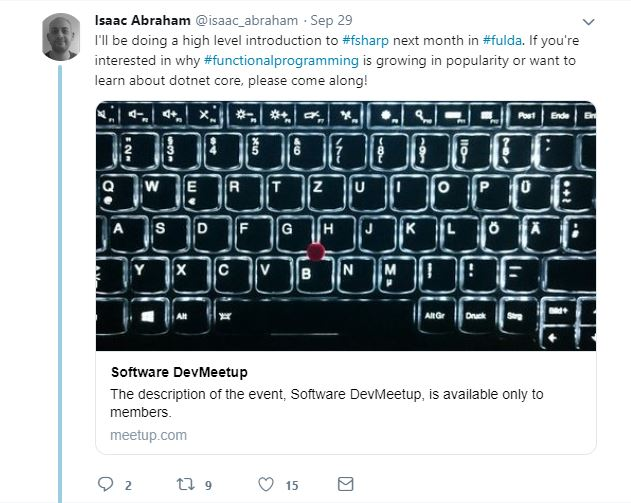
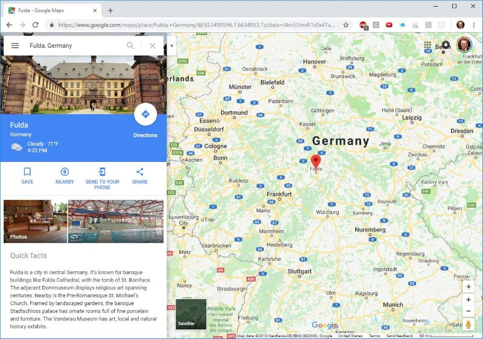
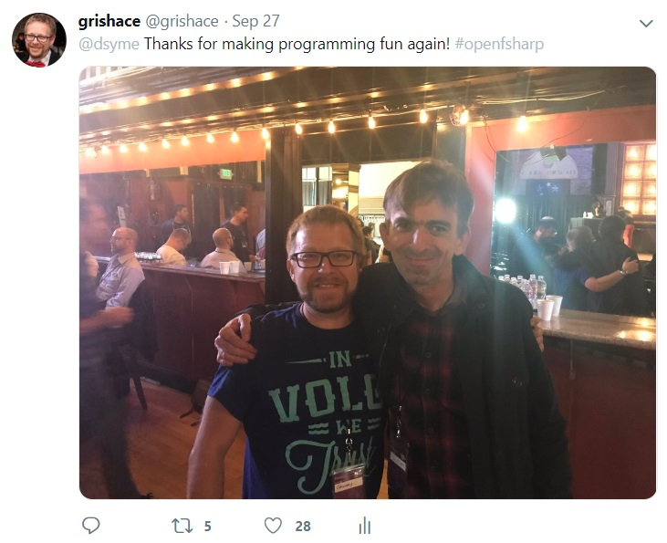
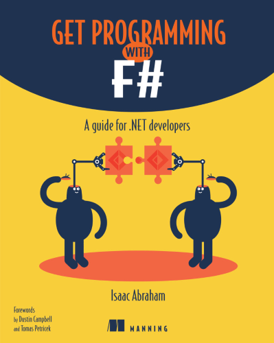
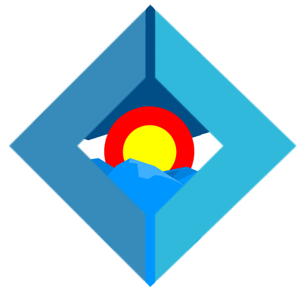

- title : Have a SAFE Trip to F#
- description : Have a SAFE Trip to F#. Denver Dev Day (October 19, 2018)
- author : Grigoriy Belenkiy (@grishace)
- theme : simple
- transition : convex

***

- data-background : images/20181019DDDWelcome.png
- data-background-transition : none

' Sponsors slide (required by organizers)

***

### Have a SAFE Trip to F#

<small>Grigoriy Belenkiy 
Software engineer at 
 
<a href="https://twitter.com/@grishace/">@grishace</a>
 
 
Denver Dev Day 
October 19, 2018</small>

***

### F#

>F# is for programming.
>                 -- _Don Syme_

' .NET/Core (functional + OOP = multi-paradigm)
' open-source
' used to be a playground for C# features (generics, async)
' community-supported
' 4.5 catching up with C# (spans etc.)
' tooling - VS, VS Code + Ionide, Rider

***

### SAFE

* Suave Saturn/Giraffe
* Azure
* Fable
* Elmish

' LAMP/MEAN - OSSOAD open-source software obsessive acronyms disorder

' Suave -- "banned" from F# community, anti-M$
' Giraffe -- functional ASP.NET Core
' Saturn -- DSL config (even more declarative, REST endpoints)
' Azure -- won't look in scope of this talk, but mention that it should be easily deployed as app service or Azure function endpoint
' Fable -- F# to JS. Mention it's not 100% the same (dates formatting, StringBuilder, etc.)
' Elmish -- Elm-ish (Elm language, MUV? pattern + Elmish.Bridge extends it over to the server side)

***

### More F#words

* FAKE5
* Fulma
* Paket?

' FAKE -- build scripts, version 5 in development ongoing breaking changes + switched to the global dotnet tool model
' Fable -- recently up to version 2, breaking changes around serialization (Thoth.Json)
' Fulma -- Bulma - CSS framework
' Paket -- Nuget

***

### Even more F#words

***

### Just a pun

***

### Fable/Elmish + Saturn

' DEMO time

***

### Elmish.Bridge

' DEMO time?

***

### Questions?

 
[https://github.com/grishace/ddd-safe](https://github.com/grishace/ddd-safe)

***

### Open F#

***

### Book

' https://www.manning.com/books/get-programming-with-f-sharp

***

### And the winner is...

' https://xkcd.com/221/

***

### F# User Group?

